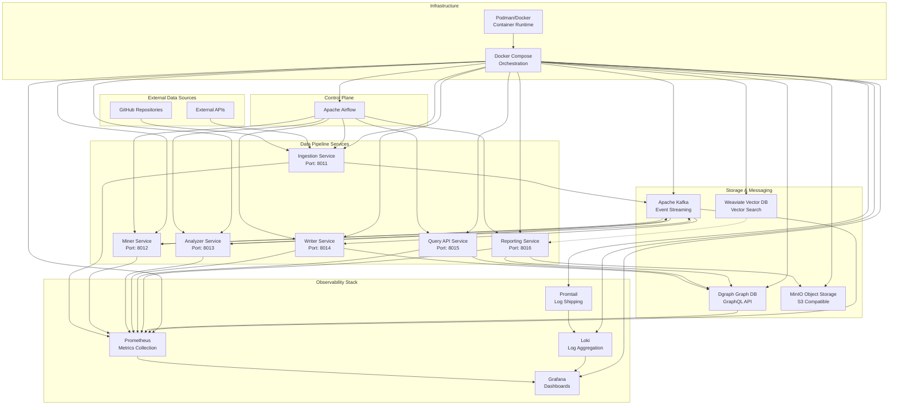
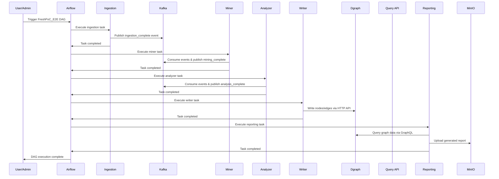

# FreshPoC System Architecture Overview

## High-Level Architecture

The FreshPoC data platform is a comprehensive, production-shaped proof-of-concept that demonstrates a complete data processing pipeline using modern open-source technologies. The architecture follows microservices patterns with clear separation of concerns and robust observability.

## Architecture Principles

### 1. **Microservices Architecture**
- Each service has a single responsibility
- Services communicate via REST APIs and Kafka events
- Independent scaling and deployment
- Technology agnostic interfaces

### 2. **Event-Driven Processing**
- Kafka serves as the central event backbone
- Asynchronous processing with guaranteed delivery
- Decoupled service dependencies
- Replay capability for debugging

### 3. **Polyglot Persistence**
- **Dgraph**: Graph database for relationship modeling
- **MinIO**: Object storage for artifacts and reports
- **Weaviate**: Vector database for similarity search
- **Kafka**: Event streaming for data pipeline

### 4. **Comprehensive Observability**
- **Metrics**: Prometheus collects service and business metrics
- **Logs**: Loki aggregates structured logs from all services
- **Traces**: Distributed tracing for request flow (planned)
- **Dashboards**: Grafana provides unified visualization

## Component Responsibilities

### Data Pipeline Services

| Service | Port | Responsibility | Technology |
|---------|------|----------------|------------|
| **Ingestion** | 8011 | Data source integration, repository cloning | FastAPI + Requests |
| **Miner** | 8012 | Metadata extraction and processing | FastAPI |
| **Analyzer** | 8013 | Data analysis and pattern detection | FastAPI |
| **Writer** | 8014 | Graph database writes and schema management | FastAPI + Dgraph HTTP API |
| **Query API** | 8015 | GraphQL query interface | FastAPI + Dgraph |
| **Reporting** | 8016 | Markdown report generation with Mermaid | FastAPI + Dgraph + MinIO |

### Storage Components

| Component | Purpose | Access Pattern | Data Model |
|-----------|---------|----------------|------------|
| **Dgraph** | Knowledge graph storage | GraphQL mutations/queries | Schema-based graph |
| **MinIO** | Artifact and report storage | S3-compatible API | Object storage |
| **Weaviate** | Vector similarity search | Vector indexing | Embedding-based |
| **Kafka** | Event streaming | Producer/consumer | Topic-based events |

### Control Plane

| Component | Purpose | Configuration |
|-----------|---------|---------------|
| **Airflow** | Workflow orchestration | DAG definitions in `/opt/airflow/dags` |
| **Scheduler** | Task execution timing | Configurable parallelism |
| **Web UI** | Monitoring and management | Admin interface at `:8080` |

## Network Architecture

### Port Mappings

| Service | Container Port | Host Port | Protocol |
|---------|---------------|-----------|----------|
| Airflow Web UI | 8080 | 8080 | HTTP |
| Grafana | 3000 | 3000 | HTTP |
| MinIO Console | 9001 | 9001 | HTTP |
| MinIO API | 9000 | 9000 | HTTP |
| Weaviate | 8080 | 8081 | HTTP |
| Dgraph HTTP | 8080 | 8080 | HTTP |
| Dgraph gRPC | 9080 | 9080 | gRPC |
| Dgraph Ratel | 8000 | 8000 | HTTP |
| Prometheus | 9090 | 9090 | HTTP |
| Services | Various | 8011-8016 | HTTP |

### Service Discovery

- **Internal networking**: Services communicate via Docker network
- **Service names**: DNS resolution using container names
- **External access**: Port mapping for development and demos

## Data Flow Architecture

### End-to-End Pipeline

### Event Flow

1. **Ingestion Phase**: Repository data → Kafka events
2. **Processing Phase**: Events → Extracted metadata → Analysis results
3. **Storage Phase**: Results → Graph relationships in Dgraph
4. **Reporting Phase**: Graph queries → Markdown reports → MinIO storage

## Deployment Architecture

### Container Strategy

- **Base Images**: Python 3.11-slim for all services
- **Multi-stage builds**: Optimized for production
- **Health checks**: HTTP endpoints for all services
- **Volumes**: Persistent storage for databases and logs

### Scaling Considerations

- **Horizontal scaling**: Each service can scale independently
- **Load balancing**: Reverse proxy for external traffic (planned)
- **Database scaling**: Dgraph cluster for high availability (planned)
- **Kafka partitioning**: Topic partitioning for throughput

## Security Considerations

### Current State (Development)
- **No authentication** on service APIs (development only)
- **Default credentials** for databases (admin/admin)
- **Open ports** for development access

### Production Readiness (Planned)
- **API authentication**: JWT tokens or API keys
- **Database security**: Proper credential management
- **Network security**: Service mesh with mTLS
- **Access control**: Role-based permissions

## Performance Characteristics

### Current Benchmarks
- **Service startup**: < 30 seconds for full stack
- **DAG execution**: ~2-3 minutes end-to-end
- **Graph operations**: Sub-second query response
- **Report generation**: < 10 seconds for typical graphs

### Scalability Targets
- **Concurrent users**: 10+ developers
- **Data volume**: 1000+ repositories
- **Query performance**: < 100ms for typical queries
- **Storage growth**: Linear scaling with data volume

## Technology Stack Summary

| Layer | Technology | Purpose |
|-------|------------|---------|
| **Orchestration** | Podman + Docker Compose | Container management |
| **Control Plane** | Apache Airflow | Workflow orchestration |
| **Data Pipeline** | FastAPI + Kafka | Microservices + Events |
| **Graph Database** | Dgraph | Knowledge graph storage |
| **Object Storage** | MinIO | Artifact storage |
| **Vector Database** | Weaviate | Similarity search |
| **Monitoring** | Prometheus + Grafana + Loki | Observability |
| **Documentation** | Markdown + Mermaid | Living documentation |

This architecture provides a solid foundation for a production data platform while maintaining the flexibility and observability needed for continuous evolution.
