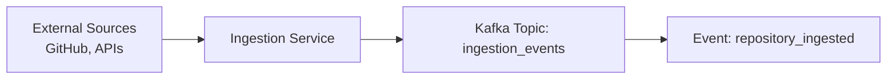
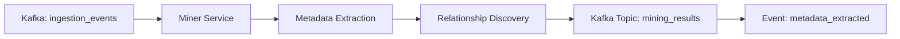
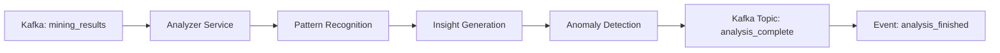
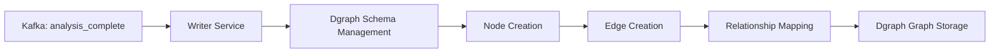
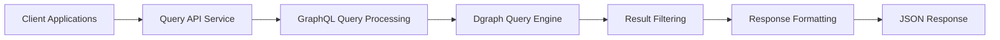
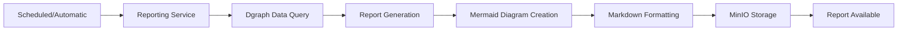
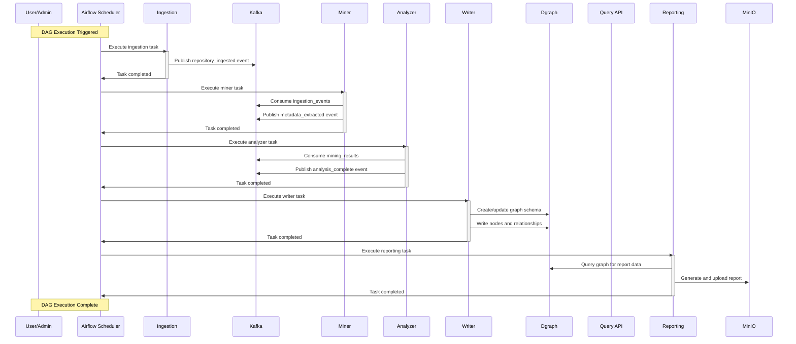
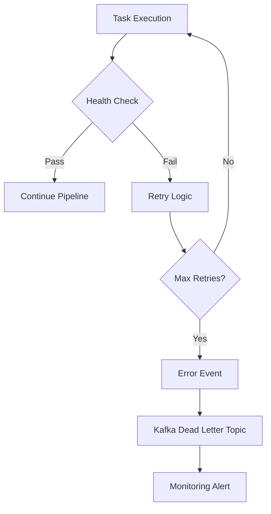
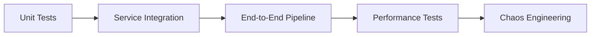

# FreshPoC Data Flow Pipeline Architecture

## Overview

The data flow pipeline in FreshPoC demonstrates a complete end-to-end data processing workflow from ingestion to reporting. The pipeline is orchestrated by Apache Airflow and uses Kafka for event-driven communication between services.

## Pipeline Stages

### 1. **Ingestion Stage**
**Service**: Ingestion Service (Port: 8011)

**Purpose**: Collect data from external sources and prepare it for processing.



**Key Operations**:
- Repository cloning and metadata extraction
- Data validation and normalization
- Event publishing to Kafka
- Error handling and retry logic

**API Endpoints**:
- `GET /health` - Health check
- `GET /trigger?repo=<url>` - Trigger ingestion for specific repository

### 2. **Mining Stage**
**Service**: Miner Service (Port: 8012)

**Purpose**: Extract detailed metadata and relationships from ingested data.



**Key Operations**:
- Event consumption from Kafka
- Code analysis and dependency extraction
- Metadata enrichment and classification
- Structured data publishing

### 3. **Analysis Stage**
**Service**: Analyzer Service (Port: 8013)

**Purpose**: Perform advanced analysis on mined data to generate insights.



**Key Operations**:
- Statistical analysis and trend detection
- Quality metrics calculation
- Risk assessment and recommendations
- Analysis result publishing

### 4. **Writing Stage**
**Service**: Writer Service (Port: 8014)

**Purpose**: Persist processed data to the graph database using Dgraph.



**Key Operations**:
- Graph schema definition and updates
- Node and relationship creation via HTTP API
- Data validation and conflict resolution
- Transaction management with commitNow

**Dgraph Integration**:
```json
{
  "schema": "name: string @index(term) . repo: string @index(exact) .",
  "mutations": {
    "set": [
      {"repo": "jaffle-shop-classic"},
      {"name": "demo-user", "repo": "jaffle-shop-classic"}
    ]
  },
  "commitNow": true
}
```

### 5. **Query Stage**
**Service**: Query API Service (Port: 8015)

**Purpose**: Provide GraphQL query interface to the knowledge graph.



**Key Operations**:
- GraphQL query parsing and validation
- Query optimization and execution
- Result pagination and filtering
- Response formatting and caching

**Sample Query**:
```graphql
{
  all(func: has(repo)) {
    uid
    repo
    name
  }
}
```

### 6. **Reporting Stage**
**Service**: Reporting Service (Port: 8016)

**Purpose**: Generate human-readable reports with visualizations.



**Key Operations**:
- Automated report scheduling
- Graph data aggregation and analysis
- Mermaid diagram generation
- Multi-format report creation
- Artifact storage and versioning

## End-to-End Sequence Flow



## Event-Driven Architecture

### Kafka Topic Structure

| Topic | Purpose | Event Types |
|-------|---------|-------------|
| **ingestion_events** | Repository ingestion notifications | `repository_ingested`, `ingestion_failed` |
| **mining_results** | Metadata extraction results | `metadata_extracted`, `mining_error` |
| **analysis_complete** | Analysis insights and findings | `analysis_finished`, `analysis_error` |
| **system_events** | System-wide notifications | `service_started`, `health_check_failed` |

### Event Schema

```json
{
  "event_id": "uuid",
  "event_type": "repository_ingested",
  "timestamp": "2025-10-04T20:40:00Z",
  "source": "ingestion_service",
  "data": {
    "repository": {
      "url": "https://github.com/dbt-labs/jaffle-shop-classic",
      "name": "jaffle-shop-classic",
      "metadata": {...}
    }
  },
  "correlation_id": "dag_run_id"
}
```

## Data Transformation Pipeline

### Data Quality Gates

1. **Ingestion Validation**
   - Source accessibility check
   - Data format validation
   - Size and complexity assessment

2. **Mining Quality**
   - Metadata completeness verification
   - Relationship consistency checks
   - Error rate monitoring

3. **Analysis Validation**
   - Statistical significance testing
   - Insight quality scoring
   - Anomaly detection thresholds

### Error Handling



## Performance Considerations

### Bottleneck Analysis

| Stage | Potential Bottleneck | Mitigation |
|-------|---------------------|------------|
| **Ingestion** | Network I/O, large repos | Async processing, batching |
| **Mining** | CPU-intensive parsing | Parallel processing, caching |
| **Writing** | Graph database writes | Batch mutations, connection pooling |
| **Reporting** | Large graph traversals | Query optimization, pagination |

### Monitoring Points

- **Throughput**: Events per second at each stage
- **Latency**: Processing time for individual items
- **Error Rates**: Failed operations and retries
- **Data Quality**: Completeness and accuracy metrics

## Integration Patterns

### Service Communication

1. **Synchronous**: HTTP REST APIs for control operations
2. **Asynchronous**: Kafka events for data processing
3. **Batch**: MinIO for report and artifact storage

### Data Consistency

- **Eventual Consistency**: Across distributed services
- **Transaction Boundaries**: Within individual service operations
- **Idempotency**: Event replay protection with correlation IDs

## Testing Strategy

### Pipeline Testing



### Test Data Flow

1. **Mock external sources** for ingestion testing
2. **Synthetic events** for pipeline component testing
3. **Golden datasets** for report validation
4. **Load testing** for performance validation

This data flow architecture ensures reliable, scalable, and maintainable data processing while providing comprehensive observability into the entire pipeline lifecycle.
