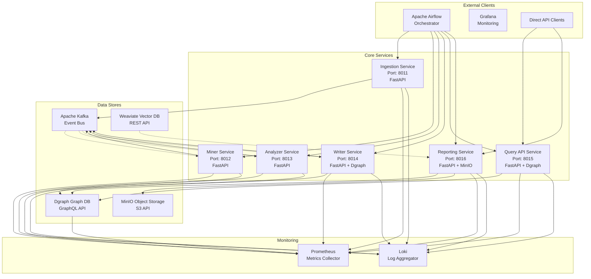
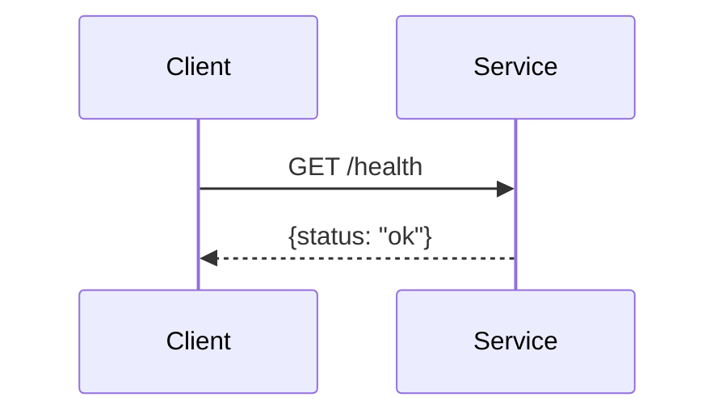
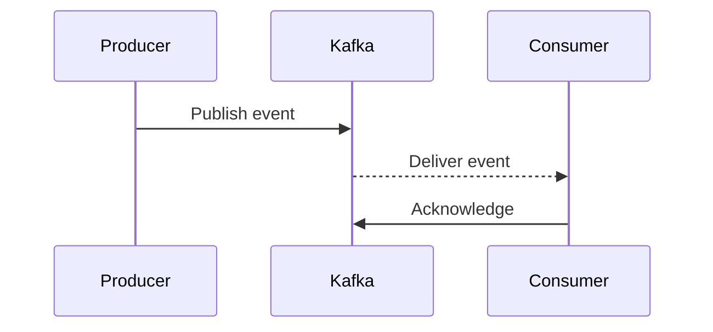
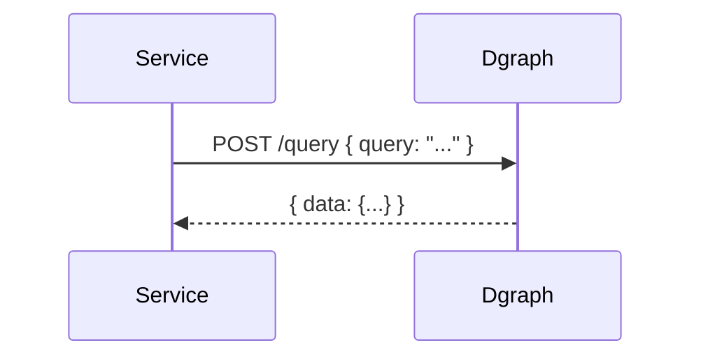
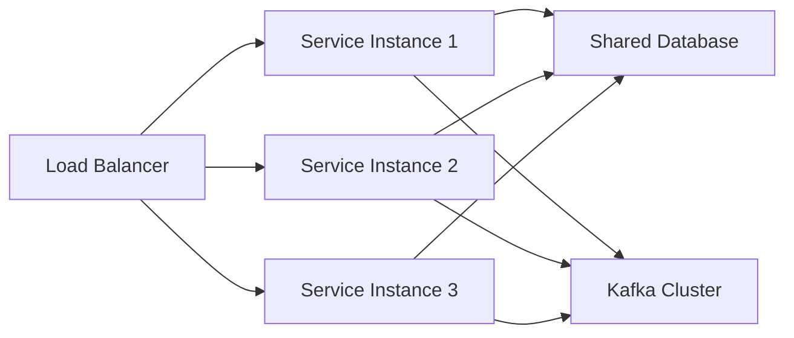
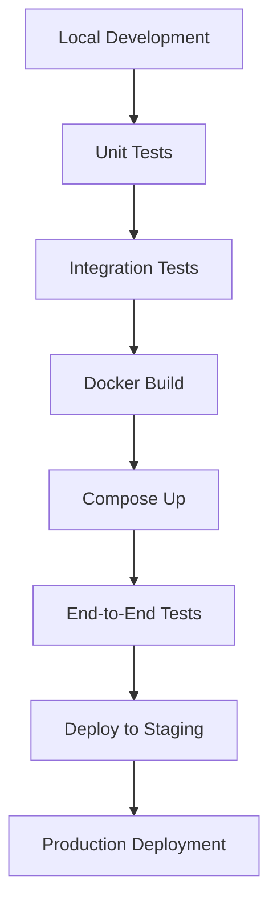
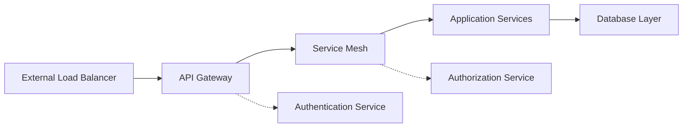

# FreshPoC Microservices Architecture

## Service Architecture Overview

The FreshPoC platform implements a microservices architecture with 6 core services, each responsible for a specific domain function. Services communicate through well-defined APIs and Kafka events, enabling independent scaling and deployment.

## Service Landscape



## Service Details

### Ingestion Service (Port: 8011)

**Responsibility**: Data source integration and initial processing.

**Technology Stack**:
- **Framework**: FastAPI
- **External APIs**: GitHub API, custom sources
- **Processing**: Repository cloning, metadata extraction

**API Contract**:
```typescript
GET /health → {status: "ok"}
GET /metrics → Prometheus exposition format
GET /trigger?repo=<url> → {ok: true, repo: "<url>"}
```

**Dependencies**:
- **Outbound**: Kafka (event publishing), MinIO (artifact storage)
- **Inbound**: Airflow (orchestration), External APIs (data sources)

### Miner Service (Port: 8012)

**Responsibility**: Deep metadata extraction and relationship discovery.

**Technology Stack**:
- **Framework**: FastAPI
- **Processing**: Code analysis, dependency resolution
- **Storage**: Kafka event consumption

**API Contract**:
```typescript
GET /health → {status: "ok"}
GET /metrics → Prometheus exposition format
GET /run → {ok: true, status: "mining_complete"}
```

**Dependencies**:
- **Outbound**: Kafka (result publishing)
- **Inbound**: Kafka (event consumption), Airflow (triggering)

### Analyzer Service (Port: 8013)

**Responsibility**: Advanced data analysis and insight generation.

**Technology Stack**:
- **Framework**: FastAPI
- **Analysis**: Statistical analysis, pattern recognition
- **ML**: Anomaly detection, quality scoring (planned)

**API Contract**:
```typescript
GET /health → {status: "ok"}
GET /metrics → Prometheus exposition format
GET /run → {ok: true, status: "analysis_complete"}
```

**Dependencies**:
- **Outbound**: Kafka (insight publishing)
- **Inbound**: Kafka (data consumption), Airflow (scheduling)

### Writer Service (Port: 8014)

**Responsibility**: Graph database operations and schema management.

**Technology Stack**:
- **Framework**: FastAPI
- **Database**: Dgraph HTTP API
- **Operations**: Schema management, data writing

**API Contract**:
```typescript
GET /health → {status: "ok"}
GET /metrics → Prometheus exposition format
GET /apply → {ok: true, nodes_created: number, edges_created: number}
```

**Key Integration**:
```json
// Schema Setup
POST /alter
{
  "schema": "name: string @index(term) . repo: string @index(exact) ."
}

// Data Writing
POST /mutate
{
  "set": [
    {"repo": "jaffle-shop-classic"},
    {"name": "demo-user", "repo": "jaffle-shop-classic"}
  ],
  "commitNow": true
}
```

**Dependencies**:
- **Outbound**: Dgraph (graph operations)
- **Inbound**: Kafka (data consumption), Airflow (coordination)

### Query API Service (Port: 8015)

**Responsibility**: GraphQL query interface for external clients.

**Technology Stack**:
- **Framework**: FastAPI
- **Query Engine**: Dgraph GraphQL+-
- **Caching**: Response caching (planned)

**API Contract**:
```typescript
GET /health → {status: "ok"}
GET /metrics → Prometheus exposition format
GET /query?q=<graphql> → {ok: true, results: {...}}
```

**Sample Queries**:
```graphql
# Get all repositories
{ all(func: has(repo)) { uid repo name } }

# Get specific repository with contributors
{ repo(func: eq(repo, "jaffle-shop-classic")) { name } }
```

**Dependencies**:
- **Outbound**: Dgraph (query execution)
- **Inbound**: Direct API clients, Reporting service

### Reporting Service (Port: 8016)

**Responsibility**: Automated report generation with visualizations.

**Technology Stack**:
- **Framework**: FastAPI
- **Templates**: Markdown with Mermaid diagrams
- **Storage**: MinIO for report archiving

**API Contract**:
```typescript
GET /health → {status: "ok"}
GET /metrics → Prometheus exposition format
GET /generate → {ok: true, file: "reports/latest.md", nodes: number}
```

**Report Generation**:
1. Query Dgraph for current data
2. Generate Mermaid diagrams
3. Format markdown report
4. Upload to MinIO bucket

**Dependencies**:
- **Outbound**: Dgraph (data queries), MinIO (storage)
- **Inbound**: Airflow (scheduling), Direct triggers

## Communication Patterns

### 1. **HTTP REST APIs**

**Pattern**: Synchronous request-response for control operations.



**Use Cases**:
- Health checks and monitoring
- Control operations (trigger, status)
- Direct API access for external clients

### 2. **Kafka Event Streaming**

**Pattern**: Asynchronous event-driven communication for data processing.



**Use Cases**:
- Data pipeline processing
- Inter-service communication
- Event sourcing and replay

### 3. **Database Queries**

**Pattern**: Direct database access for read/write operations.



**Use Cases**:
- Graph traversals and complex queries
- Schema management and mutations
- Real-time data access

## Deployment Patterns

### Service Deployment

Each service follows a consistent deployment pattern:

```yaml
# Example: Writer Service
writer:
  build: ./services/writer
  environment:
    DGRAPH_URL: http://dgraph:8080
  depends_on:
    - dgraph
  ports:
    - "8014:8014"
```

**Deployment Characteristics**:
- **Independent builds**: Each service builds separately
- **Environment configuration**: Service discovery via environment variables
- **Health checks**: HTTP endpoints for readiness
- **Graceful shutdown**: Proper cleanup on termination

### Scaling Patterns



**Scaling Strategies**:
- **Horizontal**: Multiple instances per service
- **Database**: Read replicas and partitioning
- **Kafka**: Topic partitioning for throughput
- **Stateless**: Services maintain no local state

## Service Mesh Considerations

### Current State
- **Direct communication**: Point-to-point HTTP calls
- **No service discovery**: DNS-based resolution
- **Basic monitoring**: Individual service metrics

### Future Enhancements (Planned)
- **Service mesh**: Istio or Linkerd for traffic management
- **Circuit breakers**: Resilience patterns
- **Distributed tracing**: End-to-end request tracking
- **mTLS encryption**: Secure service-to-service communication

## Development Workflow

### Service Development Cycle



### Development Tools

| Tool | Purpose | Configuration |
|------|---------|---------------|
| **Docker Compose** | Local development | `docker-compose.yml` |
| **Hot Reload** | Development speed | Volume mounting |
| **Debug Logging** | Troubleshooting | Environment variables |
| **Health Checks** | Service readiness | HTTP endpoints |

## Monitoring and Observability

### Metrics Collection

Each service exposes standard metrics:

```mermaid
graph LR
    A[Service] --> B[/metrics endpoint]
    B --> C[Prometheus]
    C --> D[Grafana Dashboard]
```

**Standard Metrics**:
- **Request count**: Total requests served
- **Response time**: Latency percentiles
- **Error rate**: Failed request percentage
- **Active connections**: Concurrent requests

### Logging Strategy

**Structured Logging**:
```json
{
  "timestamp": "2025-10-04T20:40:00Z",
  "level": "INFO",
  "service": "writer",
  "event": "node_created",
  "data": {"repo": "jaffle-shop-classic"},
  "correlation_id": "dag_123"
}
```

**Log Aggregation**:
- **Promtail**: Ships logs to Loki
- **Loki**: Queryable log storage
- **Grafana**: Log visualization and alerting

## Security Architecture

### Service Security

**Current Implementation**:
- **No authentication**: Development mode only
- **Open APIs**: All endpoints publicly accessible
- **Default credentials**: Database and service accounts

**Production Security** (Planned):
- **API Gateway**: Authentication and rate limiting
- **JWT tokens**: Service-to-service authentication
- **mTLS**: Encrypted internal communication
- **RBAC**: Role-based access control

### Network Security



This microservices architecture provides the foundation for a scalable, maintainable data platform with clear boundaries and well-defined communication patterns.
