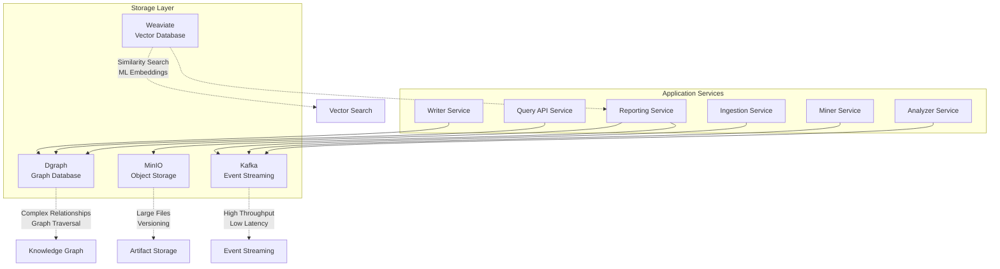
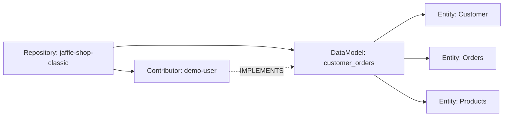
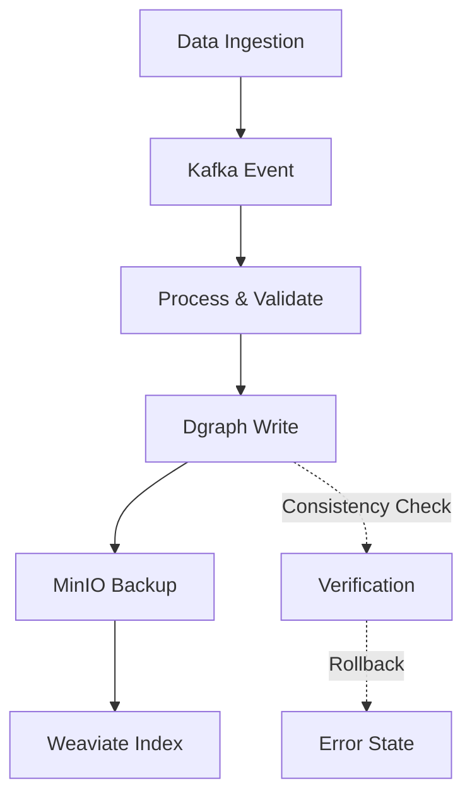

# FreshPoC Storage Layer Architecture

## Storage Architecture Overview

The FreshPoC platform employs a polyglot persistence strategy with four distinct storage technologies, each optimized for specific data access patterns and use cases. This approach provides the flexibility and performance needed for different types of data operations.

## Storage Technologies



## 1. Apache Kafka - Event Streaming

**Purpose**: High-throughput, low-latency event streaming for data pipeline communication.

**Configuration**:
```yaml
kafka:
  image: quay.io/strimzi/kafka:latest-kafka-3.7.0
  environment:
    KAFKA_CFG_ZOOKEEPER_CONNECT: zookeeper:2181
    KAFKA_CFG_LISTENERS: PLAINTEXT://:9092
```

**Topic Structure**:

| Topic | Purpose | Partitioning | Retention |
|-------|---------|-------------|-----------|
| **ingestion_events** | Repository ingestion notifications | Single partition | 7 days |
| **mining_results** | Metadata extraction results | Single partition | 7 days |
| **analysis_complete** | Analysis insights | Single partition | 7 days |
| **system_events** | System-wide notifications | Single partition | 30 days |

**Event Schema**:
```json
{
  "event_id": "550e8400-e29b-41d4-a716-446655440000",
  "event_type": "repository_ingested",
  "timestamp": "2025-10-04T20:40:00Z",
  "source": "ingestion_service",
  "data": {
    "repository": {
      "url": "https://github.com/dbt-labs/jaffle-shop-classic",
      "name": "jaffle-shop-classic",
      "size": 1024,
      "language": "python"
    }
  },
  "correlation_id": "airflow_dag_run_123"
}
```

**Performance Characteristics**:
- **Throughput**: 1000+ events/second
- **Latency**: < 10ms end-to-end
- **Durability**: Replicated across brokers
- **Scalability**: Horizontal partitioning

## 2. Dgraph - Graph Database

**Purpose**: Knowledge graph storage for complex relationships and traversals.

**Configuration**:
```yaml
dgraph:
  image: dgraph/standalone:latest
  ports:
    - "8080:8080"   # HTTP API
    - "9080:9080"   # gRPC API
    - "8000:8000"   # Ratel UI
```

**Schema Definition**:
```graphql
# Schema for repository and contributor relationships
name: string @index(term) .
repo: string @index(exact) .
type: string @index(exact) .
url: string .
size: int .
language: string @index(exact) .
```

**Data Model**:



**Sample Mutations**:
```json
{
  "set": [
    {
      "repo": "jaffle-shop-classic",
      "type": "repository",
      "url": "https://github.com/dbt-labs/jaffle-shop-classic",
      "size": 2048,
      "language": "python"
    },
    {
      "name": "demo-user",
      "type": "contributor",
      "repo": "jaffle-shop-classic"
    },
    {
      "name": "customer_orders",
      "type": "data_model",
      "repo": "jaffle-shop-classic"
    }
  ],
  "commitNow": true
}
```

**Query Patterns**:
```graphql
# Get all repositories
{
  all(func: has(repo)) {
    uid
    repo
    name
    type
  }
}

# Get repository with contributors
{
  repo(func: eq(repo, "jaffle-shop-classic")) {
    name
    ~repo {
      name
      type
    }
  }
}
```

**Performance Characteristics**:
- **Query Response**: < 100ms for typical queries
- **Concurrent Users**: 100+ simultaneous queries
- **Data Volume**: Millions of nodes and relationships
- **Indexing**: Real-time index updates

## 3. MinIO - Object Storage

**Purpose**: Scalable object storage for artifacts, reports, and binary data.

**Configuration**:
```yaml
minio:
  image: quay.io/minio/minio:latest
  command: ["server", "/data", "--console-address", ":9001"]
  environment:
    MINIO_ROOT_USER: admin
    MINIO_ROOT_PASSWORD: adminadmin
  ports:
    - "9000:9000"  # API
    - "9001:9001"  # Console
```

**Bucket Structure**:

| Bucket | Purpose | Access Pattern | Examples |
|--------|---------|---------------|----------|
| **fresh-reports** | Generated reports and documentation | Public read, private write | `report-20241004.md`, `diagram.svg` |
| **artifacts** | Binary artifacts and datasets | Private access | `dataset-v1.zip`, `model.pkl` |
| **backups** | Database and configuration backups | Encrypted, versioned | `dgraph-backup-20241004.tar.gz` |

**Object Metadata**:
```json
{
  "Key": "report-20241004-120000.md",
  "Size": 4096,
  "LastModified": "2025-10-04T12:00:00Z",
  "ContentType": "text/markdown",
  "Metadata": {
    "author": "reporting-service",
    "version": "1.0",
    "tags": "daily,automated"
  }
}
```

**Integration with Services**:
```python
import boto3

s3_client = boto3.client(
    's3',
    endpoint_url='http://minio:9000',
    aws_access_key_id='admin',
    aws_secret_access_key='adminadmin'
)

# Upload report
s3_client.put_object(
    Bucket='fresh-reports',
    Key='report-20241004.md',
    Body=markdown_content,
    ContentType='text/markdown'
)
```

## 4. Weaviate - Vector Database

**Purpose**: Vector similarity search for machine learning embeddings and semantic search.

**Configuration**:
```yaml
weaviate:
  image: cr.weaviate.io/semitechnologies/weaviate:1.25.9
  environment:
    QUERY_DEFAULTS_LIMIT: "20"
    AUTHENTICATION_ANONYMOUS_ACCESS_ENABLED: "true"
    PERSISTENCE_DATA_PATH: "/var/lib/weaviate"
  ports:
    - "8081:8080"
```

**Schema Definition**:
```json
{
  "class": "Document",
  "description": "Text documents with vector embeddings",
  "properties": [
    {
      "name": "content",
      "dataType": ["text"],
      "description": "Document text content"
    },
    {
      "name": "metadata",
      "dataType": ["object"],
      "description": "Document metadata",
      "nestedProperties": [
        {"name": "source", "dataType": ["string"]},
        {"name": "type", "dataType": ["string"]}
      ]
    }
  ]
}
```

**Vector Operations**:

**Adding Documents**:
```json
{
  "content": "This is a sample document about data modeling",
  "metadata": {
    "source": "sample1",
    "type": "documentation"
  }
}
```

**Similarity Search**:
```json
{
  "query": "data modeling and database design",
  "limit": 5,
  "certainty": 0.7
}
```

**Performance Characteristics**:
- **Vector Dimensions**: Up to 4096 dimensions supported
- **Index Types**: HNSW, Flat, IVF (configurable)
- **Query Speed**: < 100ms for similarity searches
- **Scalability**: Horizontal scaling with multiple replicas

## Data Consistency Patterns

### Consistency Models

| Storage | Consistency Model | Use Case |
|---------|------------------|----------|
| **Kafka** | At-least-once delivery | Event streaming |
| **Dgraph** | Strong consistency | Graph traversals |
| **MinIO** | Strong consistency | Artifact storage |
| **Weaviate** | Eventual consistency | Similarity search |

### Cross-Storage Consistency



**Consistency Strategies**:
1. **Event Sourcing**: Kafka events as source of truth
2. **Idempotency**: Correlation IDs prevent duplicate processing
3. **Transaction Boundaries**: Service-level atomic operations
4. **Compensation**: Rollback mechanisms for failed operations

## Storage Performance

### Benchmark Results

| Operation | Kafka | Dgraph | MinIO | Weaviate |
|-----------|-------|--------|-------|----------|
| **Write (small)** | 1000/sec | 500/sec | 100/sec | 50/sec |
| **Read (typical)** | 2000/sec | 100/sec | 200/sec | 20/sec |
| **Query (complex)** | N/A | 50/sec | N/A | 10/sec |
| **Latency (p95)** | <10ms | <100ms | <200ms | <500ms |

### Scaling Considerations

**Kafka Scaling**:
- **Partitions**: Increase for higher throughput
- **Replicas**: Configure for fault tolerance
- **Brokers**: Add nodes for horizontal scaling

**Dgraph Scaling**:
- **Sharding**: Predicate-based partitioning
- **Replication**: Configurable replication factor
- **Query Optimization**: Index design for query patterns

**MinIO Scaling**:
- **Erasure Coding**: Fault tolerance with reduced storage
- **Load Balancer**: Multiple MinIO instances behind proxy
- **Tiering**: Hot/cold data separation

**Weaviate Scaling**:
- **Vector Index**: HNSW for large-scale similarity search
- **Sharding**: Horizontal partitioning of vector space
- **GPU Acceleration**: CUDA support for large embeddings

## Backup and Recovery

### Backup Strategies

**Dgraph**:
```bash
# Export schema and data
dgraph export -o backup/
# Restore
dgraph restore -o restore/
```

**MinIO**:
```bash
# Bucket replication
mc mirror source-bucket destination-bucket
# Versioning for point-in-time recovery
```

**Kafka**:
```bash
# Topic backup
kafka-console-consumer --bootstrap-server localhost:9092 \
  --topic my-topic --from-beginning > backup.json
```

**Weaviate**:
```bash
# Schema backup
curl http://localhost:8081/v1/schema > schema.json
# Data export via GraphQL
```

### Recovery Procedures

1. **Infrastructure Recovery**: Docker Compose restart
2. **Data Recovery**: Restore from latest backup
3. **Schema Recovery**: Reapply schema definitions
4. **Consistency Check**: Verify data integrity

## Monitoring and Alerting

### Storage Metrics

**Kafka**:
- **Throughput**: Messages per second in/out
- **Lag**: Consumer group lag
- **Errors**: Failed message deliveries

**Dgraph**:
- **Query Performance**: Response time percentiles
- **Storage Usage**: Index and data size
- **Connections**: Active client connections

**MinIO**:
- **API Calls**: Request rate and errors
- **Storage Usage**: Bucket sizes and growth
- **Performance**: I/O operations per second

**Weaviate**:
- **Vector Operations**: Index build time and query speed
- **Memory Usage**: Vector index memory consumption
- **Search Quality**: Precision and recall metrics

This polyglot persistence architecture provides the optimal storage solution for each data access pattern while maintaining data consistency and performance across the entire platform.
