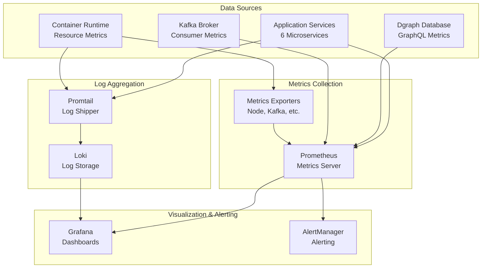
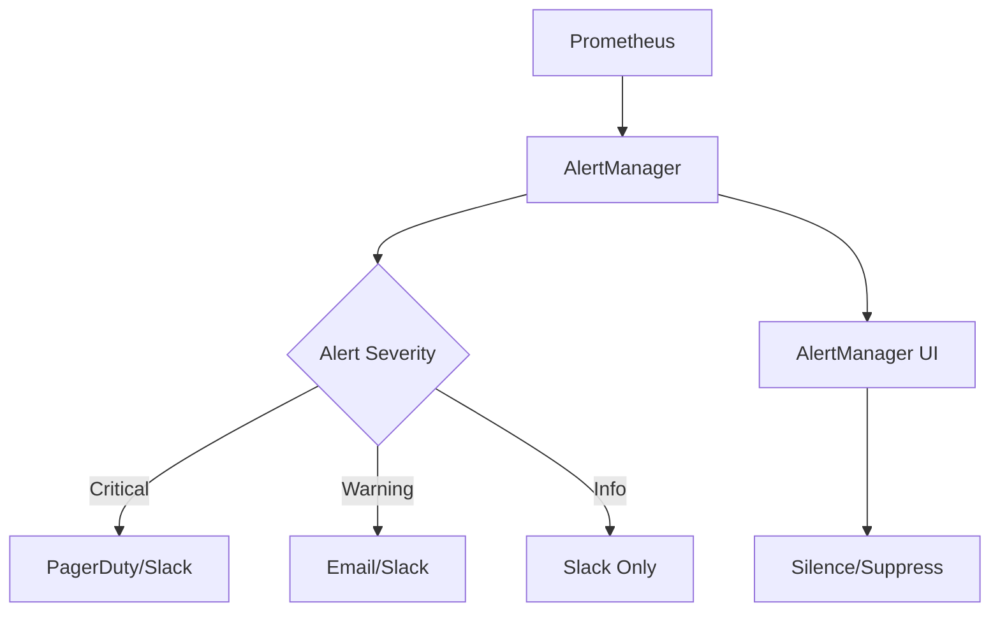
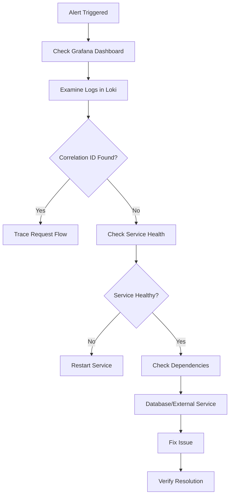

# FreshPoC Observability Stack Architecture

## Observability Architecture Overview

The FreshPoC platform implements a comprehensive observability strategy using the ELK stack (Prometheus, Grafana, Loki) to provide deep insights into system behavior, performance, and reliability across all components.

## Architecture Components



## 1. Prometheus - Metrics Collection

### Configuration

**Prometheus Server**:
```yaml
prometheus:
  image: prom/prometheus:v2.55.1
  volumes:
    - ./monitoring/prometheus.yml:/etc/prometheus/prometheus.yml:ro
  ports:
    - "9090:9090"
```

**Scraping Configuration** (`monitoring/prometheus.yml`):
```yaml
global:
  scrape_interval: 15s

scrape_configs:
  - job_name: services
    metrics_path: /metrics
    static_configs:
      - targets:
          - ingestion:8011
          - miner:8012
          - analyzer:8013
          - writer:8014
          - query-api:8015
          - reporting:8016

  - job_name: dgraph
    static_configs:
      - targets:
          - dgraph:8080

  - job_name: kafka
    static_configs:
      - targets:
          - kafka:9092

  - job_name: system
    static_configs:
      - targets:
          - prometheus:9090
```

**Scraping Strategy**:
- **Interval**: 15-second collection cycle
- **Timeout**: 10 seconds per target
- **Concurrency**: Parallel scraping for performance
- **Service Discovery**: Static configuration for containerized environment

### Service Metrics

**Standard FastAPI Metrics**:
```python
@app.get("/metrics")
def metrics():
    return """# HELP requests_total Total number of requests
# TYPE requests_total counter
requests_total{method="GET",endpoint="/health"} 150

# HELP response_time_seconds Response time in seconds
# TYPE response_time_seconds histogram
response_time_seconds_bucket{endpoint="/trigger",le="0.1"} 95
response_time_seconds_bucket{endpoint="/trigger",le="0.5"} 145
response_time_seconds_bucket{endpoint="/trigger",le="1.0"} 150
"""
```

**Key Metrics Collected**:
- **Request Count**: Total requests per endpoint
- **Response Time**: Latency percentiles (p50, p95, p99)
- **Error Rate**: Failed request percentage
- **Active Connections**: Concurrent request handling

## 2. Grafana - Visualization and Dashboards

### Configuration

**Grafana Server**:
```yaml
grafana:
  image: grafana/grafana:11.2.0
  ports:
    - "3000:3000"
  volumes:
    - ./monitoring/grafana-provisioning:/etc/grafana/provisioning:ro
```

**Data Sources**:
- **Prometheus**: Metrics data source
- **Loki**: Logs data source
- **Default**: Built-in alerting and annotation support

### Dashboard Organization

**Planned Dashboards**:
1. **System Overview**: High-level platform health
2. **Service Performance**: Individual service metrics
3. **Data Pipeline**: End-to-end pipeline monitoring
4. **Storage Layer**: Database and storage performance
5. **Error Tracking**: Failed operations and alerts

**Dashboard Structure**:
```json
{
  "dashboard": {
    "title": "FreshPoC System Overview",
    "panels": [
      {
        "title": "Service Health Status",
        "type": "stat",
        "targets": [
          {
            "expr": "up{job=\"services\"}",
            "legendFormat": "{{instance}}"
          }
        ]
      }
    ]
  }
}
```

## 3. Loki - Log Aggregation

### Configuration

**Loki Server**:
```yaml
loki:
  image: grafana/loki:3.1.1
  command: ["-config.file=/etc/loki/local-config.yaml"]
  volumes:
    - ./monitoring/loki-local-config.yaml:/etc/loki/local-config.yaml:ro
  ports:
    - "3100:3100"
```

**Local Configuration** (`monitoring/loki-local-config.yaml`):
```yaml
auth_enabled: false

server:
  http_listen_port: 3100
  grpc_listen_port: 9096

common:
  instance_addr: 127.0.0.1
  path_prefix: /tmp/loki
  storage:
    filesystem:
      chunks_directory: /tmp/loki/chunks
      rules_directory: /tmp/loki/rules

schema_config:
  configs:
    - from: 2020-10-24
      store: boltdb-shipper
      object_store: filesystem
      schema: v11
      index:
        prefix: index_
        period: 24h
```

**Storage Strategy**:
- **Chunks**: Compressed log segments
- **Index**: Lookup tables for efficient querying
- **Retention**: Configurable based on storage capacity

## 4. Promtail - Log Shipping

### Configuration

**Promtail Agent**:
```yaml
promtail:
  image: grafana/promtail:3.1.1
  volumes:
    - /var/log:/var/log:ro
    - /var/lib/containers:/var/lib/containers:ro
    - ./monitoring/promtail.yml:/etc/promtail/config.yml:ro
  command: ["--config.file=/etc/promtail/config.yml"]
```

**Scraping Configuration** (`monitoring/promtail.yml`):
```yaml
server:
  http_listen_port: 9080
  grpc_listen_port: 0

clients:
  - url: http://loki:3100/loki/api/v1/push

scrape_configs:
  - job_name: container-logs
    docker_sd_configs:
      - host: unix:///var/run/docker.sock
        refresh_interval: 5s
    relabel_configs:
      - source_labels: ['__meta_docker_container_name']
        regex: '/(.*)'
        target_label: 'container'
      - source_labels: ['__meta_docker_container_log_stream']
        target_label: 'logstream'
      - source_labels: ['__meta_docker_container_label_com_docker_compose_service']
        target_label: 'service'
```

**Log Processing Pipeline**:
1. **Discovery**: Docker container log discovery
2. **Labeling**: Metadata extraction and labeling
3. **Parsing**: JSON and structured log parsing
4. **Shipping**: Forwarding to Loki storage

## Metrics and Monitoring Strategy

### Service-Level Metrics

**Application Metrics**:
```python
from prometheus_client import Counter, Histogram, Gauge

# Request counter
requests_total = Counter('requests_total', 'Total requests', ['method', 'endpoint'])

# Response time histogram
response_time = Histogram('response_time_seconds', 'Response time', ['endpoint'])

# Active connections gauge
active_connections = Gauge('active_connections', 'Active connections')
```

**Infrastructure Metrics**:
- **CPU Usage**: Container and host CPU utilization
- **Memory Usage**: RAM consumption per service
- **Disk I/O**: Read/write operations
- **Network I/O**: Bytes in/out per interface

### Custom Business Metrics

**Data Pipeline Metrics**:
```python
# Data processing metrics
repositories_processed = Counter('repositories_processed_total', 'Total repositories processed')
data_quality_score = Gauge('data_quality_score', 'Data quality score', ['repository'])
graph_nodes_created = Counter('graph_nodes_created_total', 'Total graph nodes created')
reports_generated = Counter('reports_generated_total', 'Total reports generated')
```

**Performance Metrics**:
```python
# Performance tracking
pipeline_latency = Histogram('pipeline_latency_seconds', 'Pipeline execution time')
dgraph_query_duration = Histogram('dgraph_query_duration_seconds', 'Dgraph query time')
minio_operation_duration = Histogram('minio_operation_duration_seconds', 'MinIO operation time')
```

## Alerting Strategy

### Alert Rules

**Service Health Alerts**:
```yaml
groups:
  - name: service_health
    rules:
      - alert: ServiceDown
        expr: up{job="services"} == 0
        for: 2m
        labels:
          severity: critical
        annotations:
          summary: "Service {{ $labels.instance }} is down"
          description: "Service {{ $labels.instance }} has been down for more than 2 minutes"
```

**Performance Alerts**:
```yaml
- alert: HighResponseTime
  expr: histogram_quantile(0.95, rate(response_time_seconds_bucket[5m])) > 1.0
  for: 5m
  labels:
    severity: warning
  annotations:
    summary: "High response time detected"
    description: "95th percentile response time is above 1 second for 5 minutes"
```

**Data Pipeline Alerts**:
```yaml
- alert: DAGFailures
  expr: increase(airflow_dag_run_failed_total[1h]) > 5
  for: 1h
  labels:
    severity: critical
  annotations:
    summary: "Multiple DAG failures detected"
    description: "More than 5 DAG failures in the last hour"
```

### Alert Routing



**Notification Channels**:
- **Critical**: Immediate notification via PagerDuty
- **Warning**: Email and Slack notification
- **Info**: Slack channel updates only

## Log Analysis and Querying

### Structured Logging

**Log Format**:
```json
{
  "timestamp": "2025-10-04T20:40:00.000Z",
  "level": "INFO",
  "service": "writer",
  "event": "node_created",
  "correlation_id": "dag_run_123",
  "data": {
    "repository": "jaffle-shop-classic",
    "nodes_created": 2,
    "edges_created": 1
  },
  "duration_ms": 150
}
```

**Log Levels**:
- **ERROR**: System failures and exceptions
- **WARN**: Deprecated features and recoverable issues
- **INFO**: Normal operational events
- **DEBUG**: Detailed diagnostic information

### Loki Query Language

**Common Query Patterns**:
```logql
# Filter by service and level
{service="writer"} |= "node_created"

# Count errors by service
sum by (service) (count_over_time({level="ERROR"}[1h]))

# Find slow operations
{service="dgraph"} | json | duration_ms > 1000

# Track correlation IDs
{correlation_id=~".*dag_.*"}
```

**Dashboard Queries**:
```logql
# Error rate over time
sum by (service) (count_over_time({level="ERROR"}[5m]))

# Request volume by endpoint
sum by (endpoint) (count_over_time({event="request"}[1m]))
```

## Performance Monitoring

### System Performance

**Resource Utilization**:
- **CPU Usage**: Per-service and total cluster usage
- **Memory Consumption**: RAM usage patterns
- **Disk I/O**: Read/write throughput
- **Network Traffic**: Inter-service communication

**Performance Baselines**:
- **Service Startup**: < 30 seconds for full stack
- **DAG Execution**: 2-3 minutes end-to-end
- **Query Response**: < 100ms for typical graph queries
- **Report Generation**: < 10 seconds for standard reports

### Capacity Planning

**Growth Projections**:
- **Data Volume**: Linear growth with repository count
- **Query Load**: Expected to grow with user adoption
- **Storage Needs**: Based on retention policies

**Scaling Triggers**:
- **CPU > 80%**: Scale service instances
- **Memory > 85%**: Increase container limits
- **Error Rate > 5%**: Investigate and optimize
- **Response Time > 1s**: Performance tuning required

## Troubleshooting Workflow

### Incident Response



### Debugging Tools

**Available Tools**:
1. **Grafana Dashboards**: Visual system overview
2. **Loki Log Explorer**: Structured log querying
3. **Prometheus Query Browser**: Metric exploration
4. **Docker Logs**: Individual container logs
5. **Service Health Checks**: Built-in health endpoints

**Debugging Commands**:
```bash
# Check service health
curl http://localhost:8011/health

# View recent logs
docker-compose logs -f writer

# Query specific metrics
curl http://localhost:9090/api/v1/query?query=up{job="services"}

# Search logs for errors
curl "http://localhost:3100/loki/api/v1/query_range" \
  -d 'query={level="ERROR"}' \
  -d 'start=1633384800' \
  -d 'end=1633388400'
```

## Best Practices

### Metrics Collection
- **Consistent Naming**: Use service and operation names
- **Cardinality Management**: Avoid high-cardinality labels
- **Retention Policies**: Balance storage vs debugging needs
- **Alert Fatigue Prevention**: Set appropriate thresholds

### Logging Strategy
- **Structured Format**: JSON for machine readability
- **Correlation IDs**: Track requests across services
- **Context Preservation**: Include relevant metadata
- **Performance Impact**: Asynchronous logging where possible

### Dashboard Design
- **User-Friendly**: Clear labels and appropriate scales
- **Actionable**: Focus on metrics that drive decisions
- **Real-Time**: Live updates for operational monitoring
- **Historical**: Trends and capacity planning data

This observability stack provides comprehensive monitoring, logging, and alerting capabilities that enable proactive system management and rapid incident response for the FreshPoC platform.
