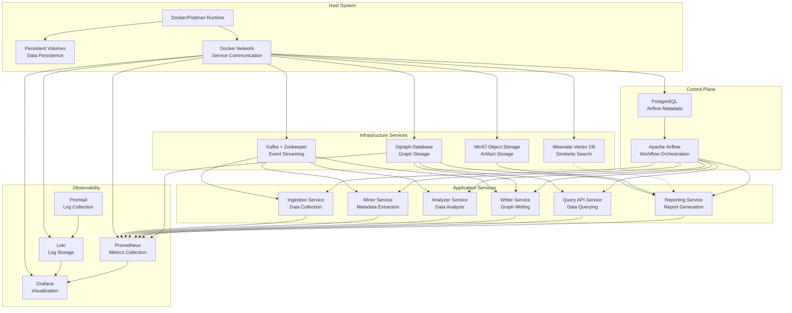
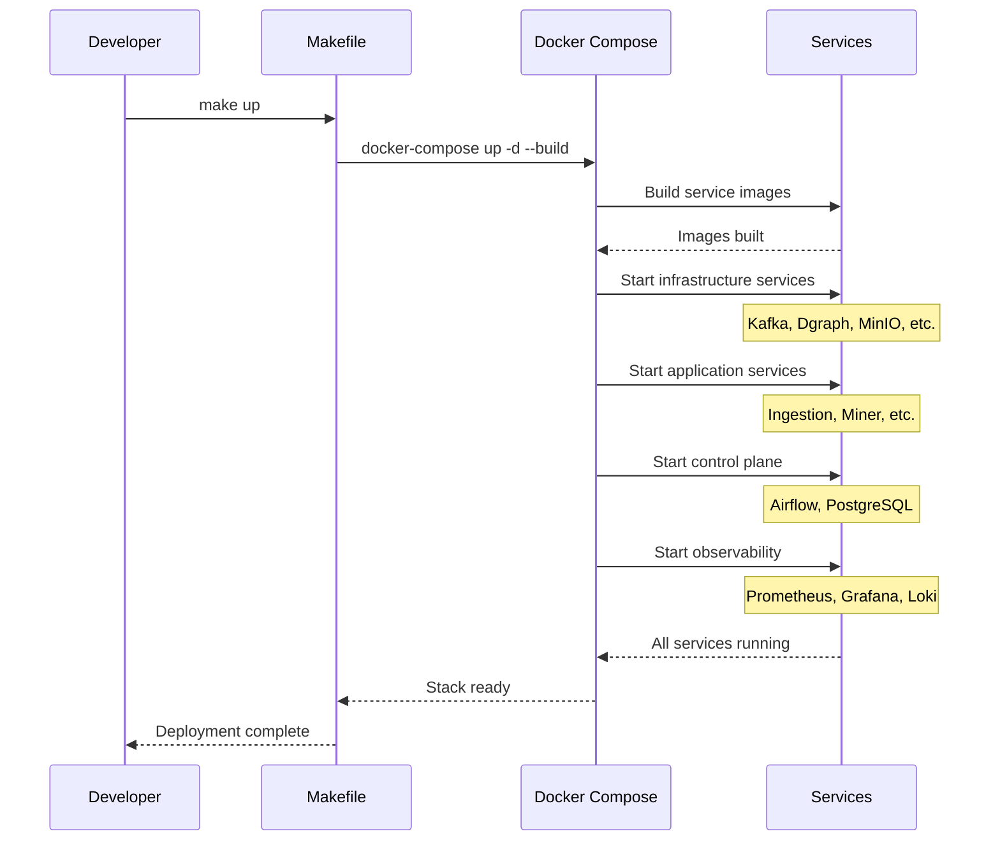
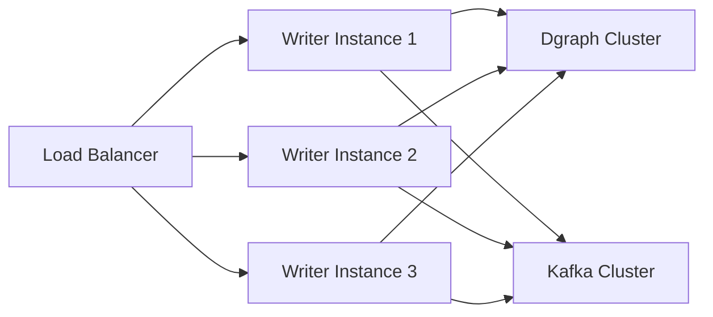

# FreshPoC Deployment Architecture

## Deployment Overview

The FreshPoC platform uses Docker Compose for containerized deployment, providing a consistent and reproducible environment across development, testing, and production. The architecture supports both Podman and Docker runtimes with comprehensive service orchestration.

## Infrastructure Architecture



## Docker Compose Configuration

### Complete Stack Definition

```yaml
version: "3.9"
services:
  # Infrastructure Services
  zookeeper:
    image: quay.io/strimzi/kafka:latest-kafka-3.7.0
    command: ["sh","-c","bin/zookeeper-server-start.sh config/zookeeper.properties"]

  kafka:
    image: quay.io/strimzi/kafka:latest-kafka-3.7.0
    depends_on: [zookeeper]
    environment:
      KAFKA_CFG_ZOOKEEPER_CONNECT: zookeeper:2181

  # Storage Services
  dgraph:
    image: dgraph/standalone:latest
    ports: ["8080:8080", "9080:9080", "8000:8000"]

  minio:
    image: quay.io/minio/minio:latest
    command: ["server", "/data", "--console-address", ":9001"]
    ports: ["9000:9000", "9001:9001"]
    environment:
      MINIO_ROOT_USER: admin
      MINIO_ROOT_PASSWORD: adminadmin

  weaviate:
    image: cr.weaviate.io/semitechnologies/weaviate:1.25.9
    ports: ["8081:8080"]

  # Application Services
  ingestion:
    build: ./services/ingestion
    ports: ["8011:8011"]
    depends_on: [kafka, minio]

  miner:
    build: ./services/miner
    ports: ["8012:8012"]
    depends_on: [kafka]

  analyzer:
    build: ./services/analyzer
    ports: ["8013:8013"]
    depends_on: [kafka]

  writer:
    build: ./services/writer
    ports: ["8014:8014"]
    depends_on: [dgraph]

  query-api:
    build: ./services/query-api
    ports: ["8015:8015"]
    depends_on: [dgraph]

  reporting:
    build: ./services/reporting
    ports: ["8016:8016"]
    depends_on: [minio, dgraph]

  # Control Plane
  airflow-db:
    image: postgres:15-alpine

  airflow:
    image: apache/airflow:2.10.2-python3.11
    depends_on: [airflow-db]
    ports: ["8080:8080"]
    volumes:
      - ./airflow/dags:/opt/airflow/dags
      - ./airflow/plugins:/opt/airflow/plugins

  # Observability
  prometheus:
    image: prom/prometheus:v2.55.1
    ports: ["9090:9090"]

  grafana:
    image: grafana/grafana:11.2.0
    ports: ["3000:3000"]

  loki:
    image: grafana/loki:3.1.1
    ports: ["3100:3100"]

  promtail:
    image: grafana/promtail:3.1.1
    volumes:
      - /var/log:/var/log:ro
      - /var/lib/containers:/var/lib/containers:ro

# Persistent Storage
volumes:
  minio-data: {}
  weaviate-data: {}
  dgraph-data: {}
  airflow-db: {}
```

## Service Deployment Patterns

### 1. **Multi-Stage Docker Builds**

Each service uses optimized Docker builds:

```dockerfile
# services/ingestion/Dockerfile
FROM python:3.11-slim
WORKDIR /app
ENV PYTHONDONTWRITEBYTECODE=1 PYTHONUNBUFFERED=1
RUN pip install --no-cache-dir fastapi uvicorn[standard] requests
COPY app.py /app/app.py
EXPOSE 8011
HEALTHCHECK --interval=10s --timeout=3s --retries=5 CMD curl -fsS http://localhost:8011/health || exit 1
CMD ["python", "/app/app.py"]
```

**Build Optimization**:
- **Base Image**: Minimal Python 3.11 image
- **Dependency Caching**: Layer caching for faster builds
- **Security**: Non-root user and minimal packages
- **Health Checks**: Built-in readiness probes

### 2. **Service Discovery**

**DNS Resolution**:
- Services communicate using container names
- Automatic DNS resolution within Docker network
- No external service discovery required for development

**Environment Variables**:
```bash
# Service configuration via environment
KAFKA_BOOTSTRAP=kafka:9092
DGRAPH_URL=http://dgraph:8080
MINIO_ENDPOINT=http://minio:9000
```

### 3. **Health Check Strategy**

Each service implements comprehensive health checks:

```python
@app.get("/health")
async def health():
    # Check dependencies
    # Check database connectivity
    # Check external services
    return {"status": "ok"}
```

**Health Check Endpoints**:
- **All Services**: `/health` endpoint
- **Database Services**: Built-in health endpoints
- **External APIs**: Dependency checks

## Volume Management

### Persistent Data

```yaml
volumes:
  minio-data:      # Object storage data
  weaviate-data:   # Vector database data
  dgraph-data:     # Graph database data
  airflow-db:      # PostgreSQL metadata
```

**Volume Types**:
- **Named Volumes**: Managed by Docker
- **Bind Mounts**: For configuration files
- **Read-Only**: For configuration and certificates

### Data Persistence Strategy

| Service | Data Type | Persistence | Backup Strategy |
|---------|-----------|-------------|-----------------|
| **Dgraph** | Graph data | Named volume | Export/Import |
| **MinIO** | Objects | Named volume | Bucket replication |
| **Weaviate** | Vectors | Named volume | Schema + data export |
| **Airflow** | Metadata | Named volume | PostgreSQL dump |
| **Logs** | Application logs | Host filesystem | Log rotation |

## Network Architecture

### Internal Networking

**Docker Network**:
- **Driver**: Bridge (default)
- **Subnet**: Automatic assignment
- **DNS**: Built-in service discovery

**Port Configuration**:
```yaml
ports:
  - "8080:8080"    # Airflow Web UI
  - "3000:3000"    # Grafana
  - "9000:9000"    # MinIO API
  - "9001:9001"    # MinIO Console
  - "8081:8080"    # Weaviate
  - "8000:8000"    # Dgraph Ratel UI
  - "9090:9090"    # Prometheus
  - "8011:8011"    # Ingestion service
  # ... additional services
```

### External Access Patterns

**Development Access**:
- All services accessible via localhost
- Port mapping for external tools
- No authentication for development

**Production Access** (Planned):
- **API Gateway**: Reverse proxy for external traffic
- **Load Balancer**: Distribution across service instances
- **Firewall**: Restricted port access

## Deployment Workflow

### Development Deployment

```bash
# Start complete stack
make up

# View service status
make ps

# Check logs
make logs

# Stop everything
make down
```

**Makefile Targets**:
```makefile
.PHONY: up down logs ps validate

up:
	docker-compose up -d --build

down:
	docker-compose down -v

logs:
	docker-compose logs -f --tail=200

ps:
	docker ps --format '{{.Names}}\t{{.Status}}\t{{.Ports}}'

validate:
	python3 scripts/validate_mcp.py
```

### Deployment Sequence



## Scaling and High Availability

### Current State (Single Instance)

**Development Configuration**:
- All services run as single instances
- No load balancing or failover
- Suitable for development and testing

### Production Scaling (Planned)

**Horizontal Scaling**:
```yaml
# Example: Scale writer service
writer:
  # ... service definition
  deploy:
    replicas: 3
    resources:
      limits:
        cpus: '0.5'
        memory: 512M
```

**Load Balancing Strategy**:


**High Availability**:
- **Database Clustering**: Dgraph cluster with replicas
- **Kafka Replication**: Multiple brokers with partitioning
- **Service Redundancy**: Multiple instances per service
- **Load Balancing**: External load balancer for traffic distribution

## Configuration Management

### Environment-Based Configuration

**Development**:
```bash
# .env file for local development
MINIO_ROOT_USER=admin
MINIO_ROOT_PASSWORD=adminadmin
AIRFLOW_USER=admin
AIRFLOW_PASSWORD=admin
```

**Production**:
```bash
# Production secrets management
MINIO_ROOT_USER=prod-admin
MINIO_ROOT_PASSWORD=<vault-secret>
DGRAPH_CREDENTIALS=<encrypted>
```

### Configuration Hierarchy

1. **Docker Compose**: Service definitions and networking
2. **Environment Variables**: Runtime configuration
3. **Config Files**: Monitoring and application configs
4. **Secrets Management**: Secure credential storage (planned)

## Monitoring Integration

### Service Monitoring

**Health Check Integration**:
```yaml
healthcheck:
  test: ["CMD", "curl", "-f", "http://localhost:8011/health"]
  interval: 10s
  timeout: 5s
  retries: 10
```

**Metrics Exposition**:
- **Prometheus**: `/metrics` endpoints on all services
- **Grafana**: Dashboard integration
- **Alerting**: Automated health monitoring

### Log Aggregation

**Promtail Configuration**:
- **Container Discovery**: Automatic log source detection
- **Label Extraction**: Service and container metadata
- **Structured Parsing**: JSON log format support

## Security Considerations

### Development Security

**Current Implementation**:
- **Default Credentials**: Admin/admin for databases
- **Open Ports**: All services accessible locally
- **No Encryption**: Plain HTTP communication

**Security Measures**:
- **Network Isolation**: Internal Docker network
- **Resource Limits**: Container resource constraints
- **Health Monitoring**: Automated failure detection

### Production Security (Planned)

**Enhanced Security**:
- **Authentication**: JWT-based service authentication
- **Authorization**: Role-based access control
- **Encryption**: TLS for external communication
- **Secrets Management**: Vault or similar for credentials
- **Network Policies**: Service mesh security

## Performance Optimization

### Resource Allocation

**Container Resources**:
```yaml
deploy:
  resources:
    limits:
      cpus: '0.5'
      memory: 512M
    reservations:
      cpus: '0.25'
      memory: 256M
```

**Resource Optimization**:
- **CPU Limits**: Prevent resource starvation
- **Memory Limits**: Container isolation
- **Health Checks**: Fast failure detection
- **Startup Order**: Dependency management

### Startup Optimization

**Service Dependencies**:
```yaml
depends_on:
  kafka:
    condition: service_healthy
  minio:
    condition: service_healthy
```

**Parallel Startup**:
- **Infrastructure First**: Databases and storage
- **Services Second**: Application services
- **Observability Last**: Monitoring stack

## Backup and Recovery

### Backup Strategy

**Database Backups**:
- **Dgraph**: Schema and data export
- **PostgreSQL**: pg_dump for Airflow metadata
- **MinIO**: Bucket replication and versioning

**Automated Backups**:
```bash
# Daily backup script
#!/bin/bash
dgraph export -o /backup/dgraph-$(date +%Y%m%d)
pg_dump airflow > /backup/airflow-$(date +%Y%m%d).sql
```

### Recovery Procedures

1. **Infrastructure Recovery**: Restart containers
2. **Data Restoration**: Restore from latest backup
3. **Schema Recreation**: Reapply service configurations
4. **Service Validation**: Verify functionality post-recovery

## Development vs Production

### Environment Comparison

| Aspect | Development | Production |
|--------|-------------|------------|
| **Instances** | Single instance | Multiple replicas |
| **Resources** | Unconstrained | Resource limits |
| **Security** | Development defaults | Enhanced security |
| **Monitoring** | Basic health checks | Full observability |
| **Backup** | Manual snapshots | Automated backups |
| **Scaling** | Manual restart | Auto-scaling |

### Deployment Variations

**Development**:
- **Hot Reload**: Volume mounting for code changes
- **Debug Logging**: Verbose logging enabled
- **Resource Limits**: Minimal constraints

**Production**:
- **Optimized Images**: Multi-stage builds
- **Security Hardening**: Minimal attack surface
- **Performance Tuning**: Optimized resource usage

This deployment architecture provides a solid foundation for both development productivity and production reliability in the FreshPoC platform.
