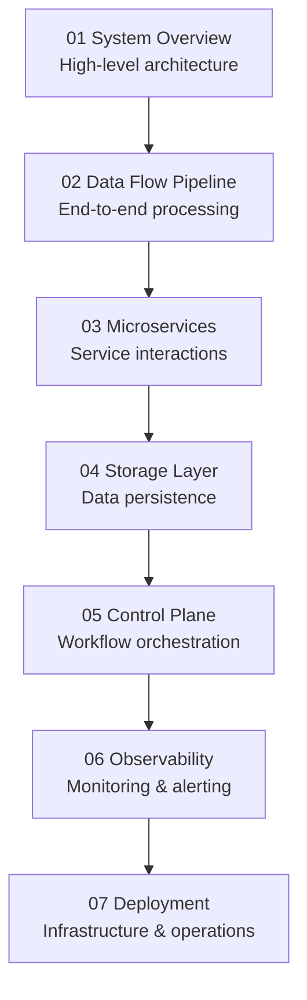

# FreshPoC Architecture Documentation

## Overview

This comprehensive documentation suite provides detailed insights into the FreshPoC data platform architecture, covering all major components, their interactions, and operational considerations.

## Documentation Structure

The architecture documentation is organized into 7 focused areas, each addressing a specific architectural concern:

## Documentation Files

| Document | Focus Area | Key Topics |
|----------|------------|------------|
| **[01-system-overview.md](01-system-overview.md)** | System Architecture | Component overview, architecture principles, technology stack |
| **[02-data-flow-pipeline.md](02-data-flow-pipeline.md)** | Data Processing | Pipeline stages, event flow, error handling |
| **[03-microservices-architecture.md](03-microservices-architecture.md)** | Service Design | API contracts, communication patterns, deployment |
| **[04-storage-layer.md](04-storage-layer.md)** | Data Storage | Dgraph, MinIO, Weaviate, Kafka configurations |
| **[05-control-plane.md](05-control-plane.md)** | Orchestration | Airflow DAGs, scheduling, monitoring |
| **[06-observability.md](06-observability.md)** | Monitoring | Prometheus, Grafana, Loki setup and usage |
| **[07-deployment.md](07-deployment.md)** | Operations | Docker Compose, scaling, security |

## Architecture Highlights

### Core Technologies

**Data Pipeline**:
- **Ingestion**: FastAPI + Kafka event publishing
- **Processing**: 6 microservices with health checks
- **Storage**: Polyglot persistence (Dgraph, MinIO, Weaviate)
- **Orchestration**: Apache Airflow with PostgreSQL metadata

**Observability**:
- **Metrics**: Prometheus scraping all services
- **Logs**: Loki with Promtail log shipping
- **Dashboards**: Grafana with comprehensive visualizations
- **Alerting**: Automated notifications and escalation

**Infrastructure**:
- **Containerization**: Docker/Podman with multi-stage builds
- **Networking**: Service discovery and port mapping
- **Volumes**: Persistent storage for all stateful services

### Key Architectural Principles

1. **Microservices**: Independent, scalable service units
2. **Event-Driven**: Asynchronous processing with Kafka
3. **Polyglot Persistence**: Right storage for each use case
4. **Comprehensive Observability**: Full-stack monitoring
5. **Infrastructure as Code**: Reproducible deployments

## Quick Access

### For Developers
- **[03-microservices-architecture.md](03-microservices-architecture.md)**: Service APIs and integration points
- **[07-deployment.md](07-deployment.md)**: Local development setup

### For Architects
- **[01-system-overview.md](01-system-overview.md)**: High-level system design
- **[04-storage-layer.md](04-storage-layer.md)**: Data architecture decisions

### For Operations
- **[05-control-plane.md](05-control-plane.md)**: Workflow orchestration
- **[06-observability.md](06-observability.md)**: Monitoring and alerting

### For DevOps
- **[07-deployment.md](07-deployment.md)**: Infrastructure and scaling
- **[06-observability.md](06-observability.md)**: Operational monitoring

## Living Documentation

This documentation is designed to be:
- **Always Current**: Updated with each architecture change
- **Comprehensive**: Covers all aspects of the platform
- **Visual**: Rich with Mermaid diagrams and flowcharts
- **Actionable**: Includes practical examples and configurations

## Related Resources

- **[../../README-PoC.md](../../README-PoC.md)**: Platform overview and quick start
- **[../../docker-compose.yml](../../docker-compose.yml)**: Complete infrastructure definition
- **[../../Makefile](../../Makefile)**: Development and deployment commands

---

*This architecture documentation provides the foundation for understanding, maintaining, and evolving the FreshPoC data platform.*
